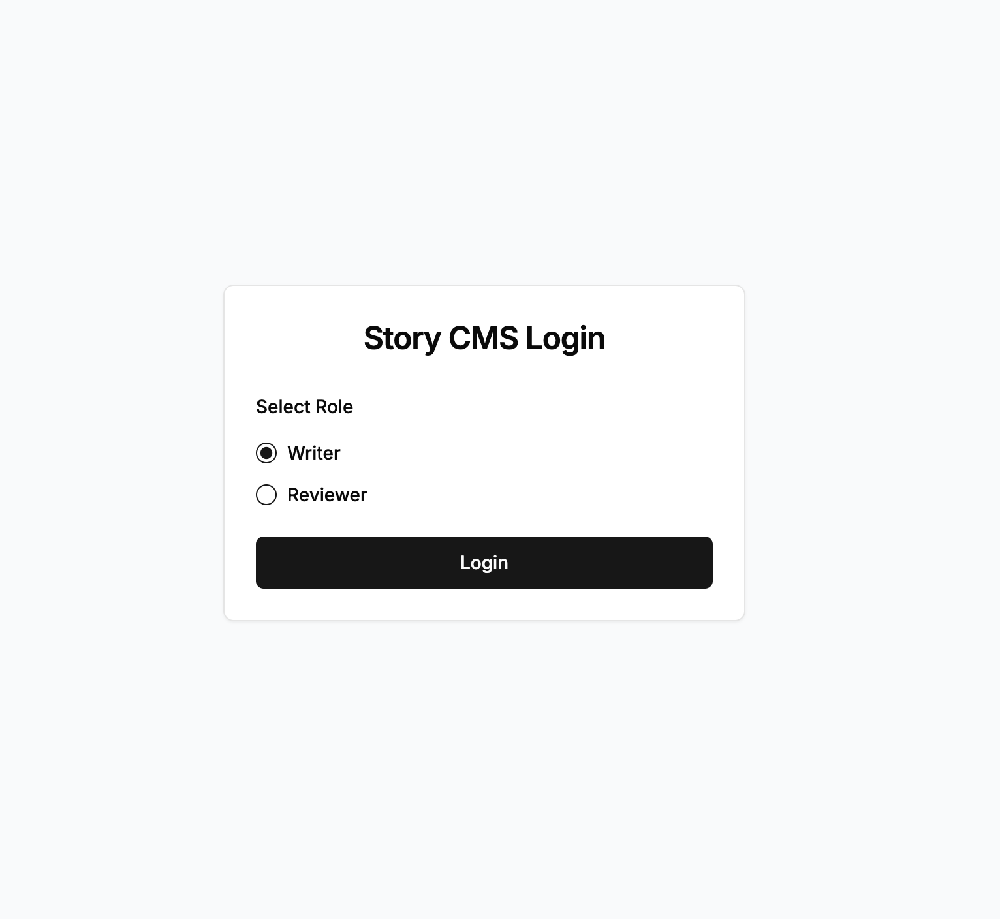
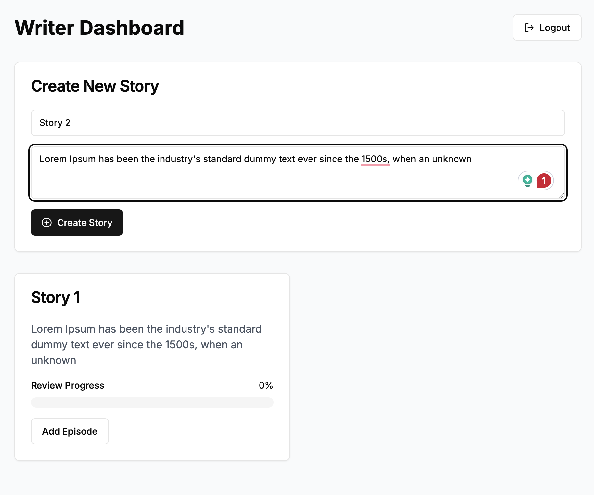
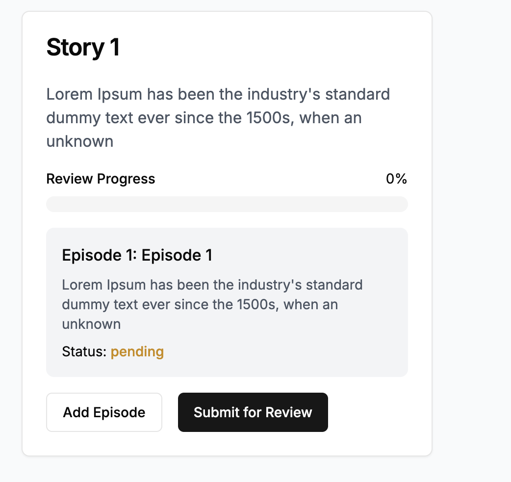
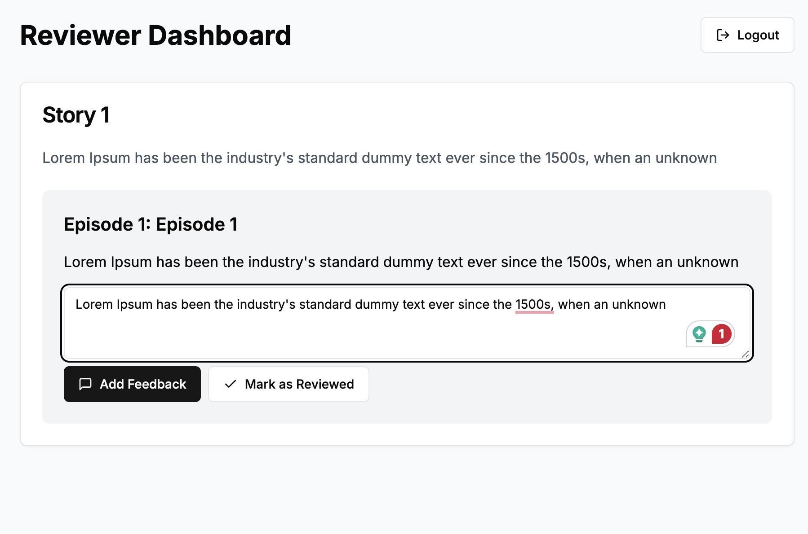
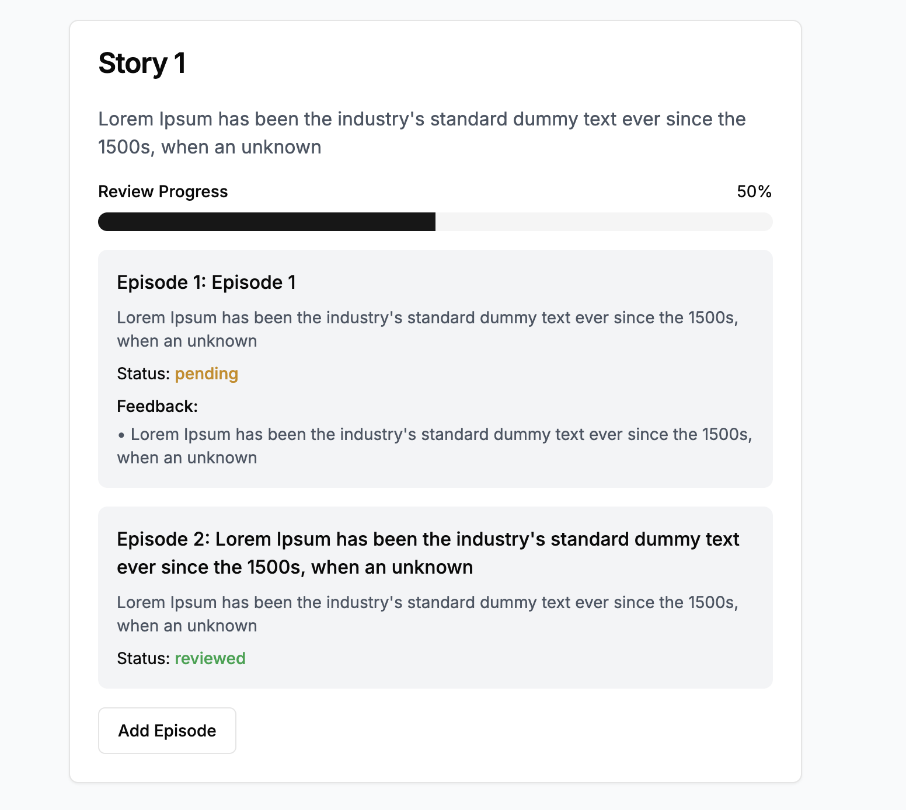

# Story CMS

A modern, responsive Content Management System for managing stories and episodes with a review workflow. Built with Next.js, TypeScript, and Tailwind CSS.

![Story CMS]
## Demo

- 
- 
- 
- 
- 

## Features

### For Writers
- 📝 Create and manage stories with multiple episodes
- 📊 Track review progress for each story
- 📑 Rich text editing for episode descriptions
- 📤 Submit stories for review
- 📈 Visual progress indicators for review status

### For Reviewers
- 📋 Review stories and episodes
- ✍️ Add feedback and comments
- ✅ Mark episodes as reviewed
- 📊 Track review progress

## Tech Stack

- **Framework**: [Next.js 13](https://nextjs.org/) with App Router
- **Language**: [TypeScript](https://www.typescriptlang.org/)
- **Styling**: [Tailwind CSS](https://tailwindcss.com/)
- **UI Components**: [shadcn/ui](https://ui.shadcn.com/)
- **Icons**: [Lucide Icons](https://lucide.dev/)
- **State Management**: React Context API
- **Authentication**: Simulated auth for demo purposes

## Getting Started

### Prerequisites

- Node.js 16.8 or later
- npm or yarn

### Installation

1. Clone the repository:
```bash
git clone https://github.com/yourusername/story-cms.git
cd story-cms
```

2. Install dependencies:
```bash
npm install
# or
yarn install
```

3. Run the development server:
```bash
npm run dev
# or
yarn dev
```

4. Open [http://localhost:3000](http://localhost:3000) in your browser.


## Key Features

### Role-Based Access
- Writer role for content creation
- Reviewer role for content review
- Role-specific dashboards and features

### Story Management
- Create and edit stories
- Add multiple episodes
- Track review status
- Visual progress indicators

### Review System
- Add feedback to episodes
- Track review progress
- Mark episodes as reviewed

### User Interface
- Responsive design
- Modern, clean UI
- Intuitive navigation
- Progress tracking


